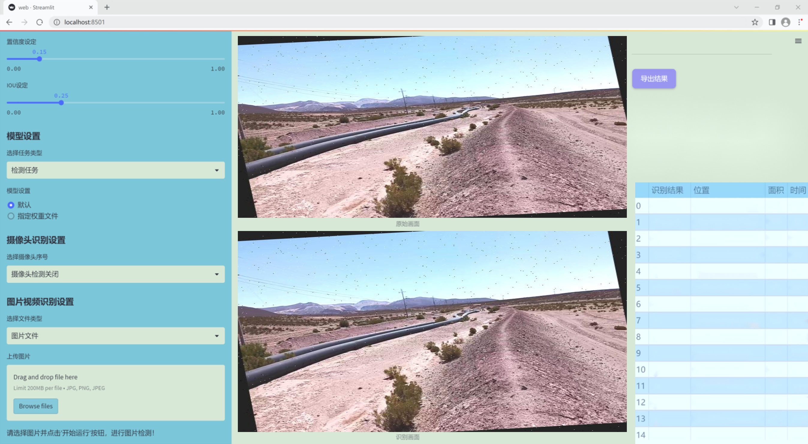
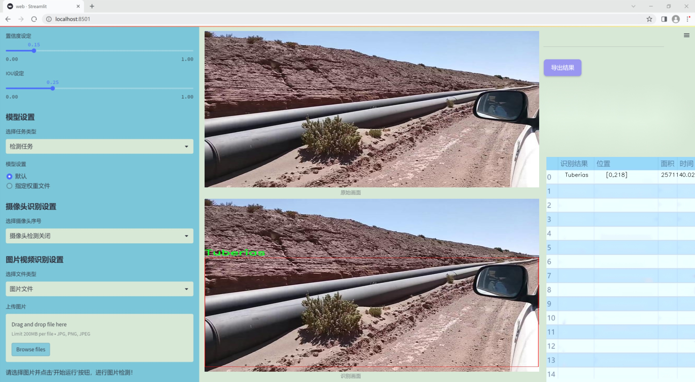
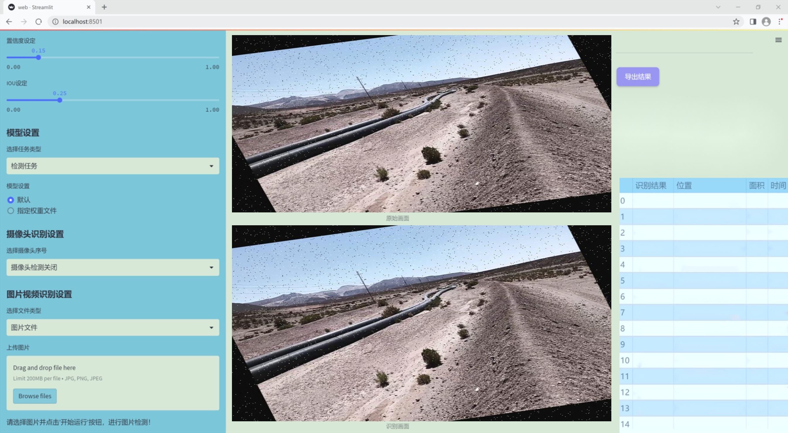
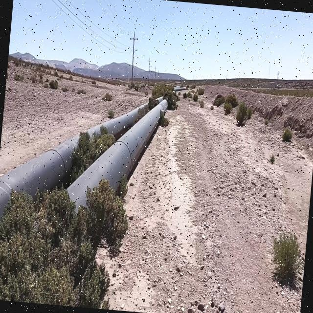
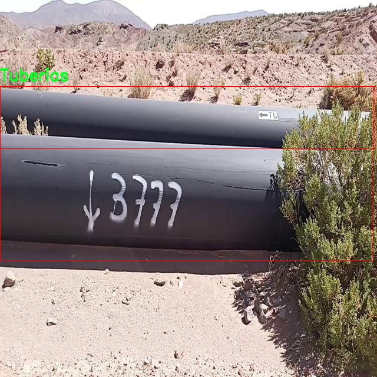
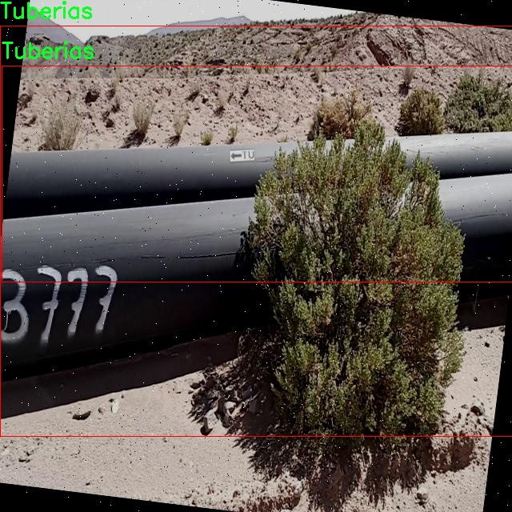
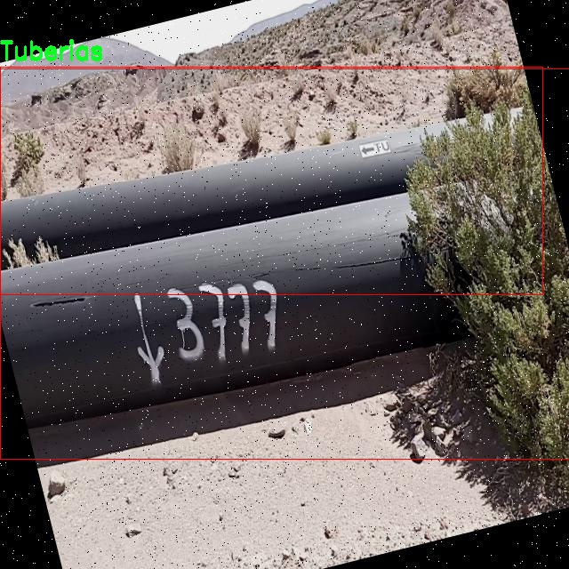
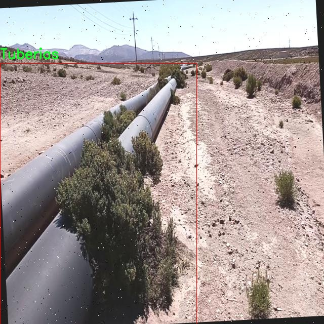

### 1.背景意义

研究背景与意义

在现代工业中，管道与支架的检测与维护是确保生产安全和效率的重要环节。随着工业自动化和智能化的不断发展，传统的人工检测方法逐渐暴露出效率低、成本高和误差大的问题。因此，开发基于计算机视觉的自动检测系统成为了行业亟待解决的课题。近年来，深度学习技术的迅猛发展为这一领域带来了新的机遇，尤其是目标检测算法的进步，使得自动化检测的精度和效率得到了显著提升。

YOLO（You Only Look Once）系列算法因其快速且高效的特性，成为了目标检测领域的热门选择。YOLOv11作为该系列的最新版本，结合了多种先进的技术和优化策略，具备了更强的特征提取能力和更高的检测精度。然而，针对特定工业场景的改进仍然是必要的，尤其是在管道与支架的检测任务中。针对这一需求，本研究提出了一种基于改进YOLOv11的管道与支架检测系统，旨在提升检测的准确性和实时性。

本研究所使用的数据集包含2408张经过精心标注的图像，涵盖了两类主要对象：Brida（支架）和Tuberias（管道）。通过对数据集的预处理和增强，包括随机旋转、亮度调整和噪声添加等手段，确保了模型在多样化场景下的鲁棒性。这些措施不仅提升了模型的泛化能力，也为后续的训练和测试提供了丰富的样本。

通过本项目的实施，期望能够为管道与支架的自动检测提供一种高效、准确的解决方案，从而降低人工成本，提高检测效率，最终推动工业智能化的发展。这一研究不仅具有重要的理论意义，也为实际应用提供了可行的技术路径，具有广泛的应用前景。

### 2.视频效果

[2.1 视频效果](https://www.bilibili.com/video/BV1EeBeYAERq/)

### 3.图片效果







##### [项目涉及的源码数据来源链接](https://kdocs.cn/l/cszuIiCKVNis)**

注意：本项目提供训练的数据集和训练教程,由于版本持续更新,暂不提供权重文件（best.pt）,请按照6.训练教程进行训练后实现上图演示的效果。

### 4.数据集信息

##### 4.1 本项目数据集类别数＆类别名

nc: 2
names: ['Brida', 'Tuberias']


该项目为【目标检测】数据集，请在【训练教程和Web端加载模型教程（第三步）】这一步的时候按照【目标检测】部分的教程来训练

##### 4.2 本项目数据集信息介绍

本项目数据集信息介绍

本项目所使用的数据集专注于管道与支架检测，旨在为改进YOLOv11的检测系统提供高质量的训练数据。数据集包含两个主要类别，分别为“Brida”（法兰）和“Tuberias”（管道），这些类别的选择反映了在工业环境中管道系统的重要组成部分。数据集的设计旨在涵盖各种实际应用场景，以确保模型在不同条件下的鲁棒性和准确性。

在数据收集过程中，我们采用了多种方法获取图像，包括现场拍摄和现有图像库的整合。所有图像均经过精心标注，确保每个实例的准确性，以便为YOLOv11模型提供清晰的学习目标。数据集中包含了多种角度、光照条件和背景环境下的图像，以模拟真实世界中可能遇到的各种情况。这种多样性有助于模型在实际应用中表现出更好的泛化能力。

此外，数据集还考虑了不同尺寸和形状的管道及法兰，以便于模型学习到更为丰富的特征。这些特征不仅包括物体的外观，还涵盖了其在特定环境中的相对位置和空间关系。通过这样的设计，我们希望能够提升YOLOv11在管道与支架检测任务中的性能，使其能够更准确地识别和定位目标物体。

总之，本项目的数据集为改进YOLOv11的管道与支架检测系统提供了坚实的基础，涵盖了多样化的场景和实例，以支持模型的训练和优化。通过对“Brida”和“Tuberias”这两个类别的深入研究，我们期望能够在实际应用中实现更高的检测精度和效率，为相关行业的智能化发展贡献力量。











### 5.全套项目环境部署视频教程（零基础手把手教学）

[5.1 所需软件PyCharm和Anaconda安装教程（第一步）](https://www.bilibili.com/video/BV1BoC1YCEKi/?spm_id_from=333.999.0.0&vd_source=bc9aec86d164b67a7004b996143742dc)


[5.2 安装Python虚拟环境创建和依赖库安装视频教程（第二步）](https://www.bilibili.com/video/BV1ZoC1YCEBw?spm_id_from=333.788.videopod.sections&vd_source=bc9aec86d164b67a7004b996143742dc)

### 6.改进YOLOv11训练教程和Web_UI前端加载模型教程（零基础手把手教学）

[6.1 改进YOLOv11训练教程和Web_UI前端加载模型教程（第三步）](https://www.bilibili.com/video/BV1BoC1YCEhR?spm_id_from=333.788.videopod.sections&vd_source=bc9aec86d164b67a7004b996143742dc)


按照上面的训练视频教程链接加载项目提供的数据集，运行train.py即可开始训练



     Epoch   gpu_mem       box       obj       cls    labels  img_size
     1/200     20.8G   0.01576   0.01955  0.007536        22      1280: 100%|██████████| 849/849 [14:42<00:00,  1.04s/it]
               Class     Images     Labels          P          R     mAP@.5 mAP@.5:.95: 100%|██████████| 213/213 [01:14<00:00,  2.87it/s]
                 all       3395      17314      0.994      0.957      0.0957      0.0843

     Epoch   gpu_mem       box       obj       cls    labels  img_size
     2/200     20.8G   0.01578   0.01923  0.007006        22      1280: 100%|██████████| 849/849 [14:44<00:00,  1.04s/it]
               Class     Images     Labels          P          R     mAP@.5 mAP@.5:.95: 100%|██████████| 213/213 [01:12<00:00,  2.95it/s]
                 all       3395      17314      0.996      0.956      0.0957      0.0845

     Epoch   gpu_mem       box       obj       cls    labels  img_size
     3/200     20.8G   0.01561    0.0191  0.006895        27      1280: 100%|██████████| 849/849 [10:56<00:00,  1.29it/s]
               Class     Images     Labels          P          R     mAP@.5 mAP@.5:.95: 100%|███████   | 187/213 [00:52<00:00,  4.04it/s]
                 all       3395      17314      0.996      0.957      0.0957      0.0845


###### [项目数据集下载链接](https://kdocs.cn/l/cszuIiCKVNis)

### 7.原始YOLOv11算法讲解


##### YOLO11介绍

Ultralytics YOLO11是一款尖端的、最先进的模型，它在之前YOLO版本成功的基础上进行了构建，并引入了新功能和改进，以进一步提升性能和灵活性。
**YOLO11设计快速、准确且易于使用，使其成为各种物体检测和跟踪、实例分割、图像分类以及姿态估计任务的绝佳选择。**


**结构图如下：**


##### **C3k2**

**C3k2，结构图如下**


**C3k2，继承自类`C2f，其中通过c3k设置False或者Ture来决定选择使用C3k还是`**Bottleneck


**实现代码** **ultralytics/nn/modules/block.py**

##### C2PSA介绍

**借鉴V10 PSA结构，实现了C2PSA和C2fPSA，最终选择了基于C2的C2PSA（可能涨点更好？）**


**实现代码** **ultralytics/nn/modules/block.py**

##### Detect介绍

**分类检测头引入了DWConv（更加轻量级，为后续二次创新提供了改进点），结构图如下（和V8的区别）：**


### 8.200+种全套改进YOLOV11创新点原理讲解

#### 8.1 200+种全套改进YOLOV11创新点原理讲解大全

由于篇幅限制，每个创新点的具体原理讲解就不全部展开，具体见下列网址中的改进模块对应项目的技术原理博客网址【Blog】（创新点均为模块化搭建，原理适配YOLOv5~YOLOv11等各种版本）

[改进模块技术原理博客【Blog】网址链接](https://gitee.com/qunmasj/good)


#### 8.2 精选部分改进YOLOV11创新点原理讲解

###### 这里节选部分改进创新点展开原理讲解(完整的改进原理见上图和[改进模块技术原理博客链接](https://gitee.com/qunmasj/good)【如果此小节的图加载失败可以通过CSDN或者Github搜索该博客的标题访问原始博客，原始博客图片显示正常】


### D-LKA Attention简介
自2010年代中期以来，卷积神经网络（CNNs）已成为许多计算机视觉应用的首选技术。它们能够从原始数据中自动提取复杂的特征表示，无需手动进行特征工程，这引起了医学图像分析社区的极大兴趣。许多成功的CNN架构，如U-Net、全卷积网络、DeepLab或SegCaps（分割胶囊），已经被开发出来。这些架构在语义分割任务中取得了巨大成功，先前的最新方法已经被超越。

在计算机视觉研究中，不同尺度下的目标识别是一个关键问题。在CNN中，可检测目标的大小与相应网络层的感受野尺寸密切相关。如果一个目标扩展到超出这个感受野的边界，这可能会导致欠分割结果。相反，与目标实际大小相比使用过大的感受野可能会限制识别，因为背景信息可能会对预测产生不必要的影响。

解决这个问题的一个有希望的方法涉及在并行使用具有不同尺寸的多个Kernel，类似于Inception块的机制。然而，由于参数和计算要求的指数增长，将Kernel大小增加以容纳更大的目标在实践中受到限制。因此，出现了各种策略，包括金字塔池化技术和不同尺度的扩张卷积，以捕获多尺度的上下文信息。

另一个直观的概念涉及将多尺度图像金字塔或它们的相关特征表示直接纳入网络架构。然而，这种方法存在挑战，特别是在管理训练和推理时间方面的可行性方面存在挑战。在这个背景下，使用编码器-解码器网络，如U-Net，已被证明是有利的。这样的网络在较浅的层中编码外观和位置，而在更深的层中，通过神经元的更广泛的感受野捕获更高的语义信息和上下文信息。

一些方法将来自不同层的特征组合在一起，或者预测来自不同尺寸的层的特征以使用多尺度的信息。此外，出现了从不同尺度的层中预测特征的方法，有效地实现了跨多个尺度的见解整合。然而，大多数编码器-解码器结构面临一个挑战：它们经常无法在不同尺度之间保持一致的特征，并主要使用最后一个解码器层生成分割结果。

语义分割是一项任务，涉及根据预定义的标签集为图像中的每个像素预测语义类别。这项任务要求提取高级特征同时保留初始的空间分辨率。CNNs非常适合捕获局部细节和低级信息，尽管以忽略全局上下文为代价。视觉Transformer（ViT）架构已经成为解决处理全局信息的视觉任务的关键，包括语义分割，取得了显著的成功。

ViT的基础是注意力机制，它有助于在整个输入序列上聚合信息。这种能力使网络能够合并远程的上下文提示，超越了CNN的有限感受野尺寸。然而，这种策略通常会限制ViT有效建模局部信息的能力。这种局限可能会妨碍它们检测局部纹理的能力，这对于各种诊断和预测任务至关重要。这种缺乏局部表示可以归因于ViT模型处理图像的特定方式。

ViT模型将图像分成一系列Patch，并使用自注意力机制来模拟它们之间的依赖关系。这种方法可能不如CNN模型中的卷积操作对感受野内提取局部特征有效。ViT和CNN模型之间的这种图像处理方法的差异可能解释了CNN模型在局部特征提取方面表现出色的原因。

近年来，已经开发出创新性方法来解决Transformer模型内部局部纹理不足的问题。其中一种方法是通过互补方法将CNN和ViT特征结合起来，以结合它们的优势并减轻局部表示的不足。TransUNet是这种方法的早期示例，它在CNN的瓶颈中集成了Transformer层，以模拟局部和全局依赖关系。HiFormer提出了一种解决方案，将Swin Transformer模块和基于CNN的编码器结合起来，生成两个多尺度特征表示，通过Double-Level Fusion模块集成。UNETR使用基于Transformer的编码器和CNN解码器进行3D医学图像分割。CoTr和TransBTS通过Transformer在低分辨率阶段增强分割性能，将CNN编码器和解码器连接在一起。

增强局部特征表示的另一种策略是重新设计纯Transformer模型内部的自注意力机制。在这方面，Swin-Unet在U形结构中集成了一个具有线性计算复杂性的Swin Transformer块作为多尺度 Backbone 。MISSFormer采用高效Transformer来解决视觉Transformer中的参数问题，通过在输入块上进行不可逆的降采样操作。D-Former引入了一个纯Transformer的管道，具有双重注意模块，以分段的方式捕获细粒度的局部注意和与多元单元的交互。然而，仍然存在一些特定的限制，包括计算效率低下，如TransUNet模型所示，对CNN Backbone 的严重依赖，如HiFormer所观察到的，以及对多尺度信息的忽略。

此外，目前的分割架构通常采用逐层处理3D输入 volumetric 的方法，无意中忽视了相邻切片之间的潜在相关性。这一疏忽限制了对 volumetric 信息的全面利用，因此损害了定位精度和上下文集成。此外，必须认识到，医学领域的病变通常在形状上发生变形。因此，用于医学图像分析的任何学习算法都必须具备捕捉和理解这些变形的能力。与此同时，该算法应保持计算效率，以便处理3D volumetric数据。

为了解决上述提到的挑战，作者提出了一个解决方案，即可变形大卷积核注意力模块（Deformable LKA module），它是作者网络设计的基本构建模块。这个模块明确设计成在有效处理上下文信息的同时保留局部描述符。作者的架构在这两个方面的平衡增强了实现精确语义分割的能力。

值得注意的是，参考该博客引入了一种基于数据的感受野的动态适应，不同于传统卷积操作中的固定滤波器Mask。这种自适应方法使作者能够克服与静态方法相关的固有限制。这种创新方法还扩展到了D-LKA Net架构的2D和3D版本的开发。

在3D模型的情况下，D-LKA机制被量身定制以适应3D环境，从而实现在不同 volumetric 切片之间无缝信息交互。最后，作者的贡献通过其计算效率得到进一步强调。作者通过仅依靠D-LKA概念的设计来实现这一点，在各种分割基准上取得了显著的性能，确立了作者的方法作为一种新的SOTA方法。

在本节中，作者首先概述方法论。首先，作者回顾了由Guo等人引入的大卷积核注意力（Large Kernel Attention，LKA）的概念。然后，作者介绍了作者对可变形LKA模块的创新探索。在此基础上，作者介绍了用于分割任务的2D和3D网络架构。

大卷积核提供了与自注意力机制类似的感受野。可以通过使用深度卷积、深度可扩展卷积和卷积来构建大卷积核，从而减少了参数和计算量。构建输入维度为和通道数的卷积核的深度卷积和深度可扩展卷积的卷积核大小的方程如下：


具有卷积核大小和膨胀率。参数数量和浮点运算（FLOPs）的计算如下：


FLOPs的数量与输入图像的大小成线性增长。参数的数量随通道数和卷积核大小的增加而呈二次增长。然而，由于它们通常都很小，因此它们不是限制因素。

为了最小化对于固定卷积核大小K的参数数量，可以将方程3对于膨胀率的导数设定为零：


例如，当卷积核大小为时，结果是。将这些公式扩展到3D情况是直接的。对于大小为和通道数C的输入，3D情况下参数数量和FLOPs 的方程如下：


具有卷积核大小和膨胀。


利用大卷积核进行医学图像分割的概念通过引入可变形卷积得以扩展。可变形卷积可以通过整数偏移自由调整采样网格以进行自由变形。额外的卷积层从特征图中学习出变形，从而创建一个偏移场。基于特征本身学习变形会导致自适应卷积核。这种灵活的卷积核形状可以提高病变或器官变形的表示，从而增强了目标边界的定义。

负责计算偏移的卷积层遵循其相应卷积层的卷积核大小和膨胀。双线性插值用于计算不在图像网格上的偏移的像素值。如图2所示，D-LKA模块可以表示为：


其中输入特征由表示，。表示为注意力图，其中每个值表示相应特征的相对重要性。运算符  表示逐元素乘法运算。值得注意的是，LKA不同于传统的注意力方法，它不需要额外的规范化函数，如或。这些规范化函数往往忽视高频信息，从而降低了基于自注意力的方法的性能。

在该方法的2D版本中，卷积层被可变形卷积所替代，因为可变形卷积能够改善对具有不规则形状和大小的目标的捕捉能力。这些目标在医学图像数据中常常出现，因此这种增强尤为重要。

然而，将可变形LKA的概念扩展到3D领域会带来一定的挑战。主要的约束来自于需要用于生成偏移的额外卷积层。与2D情况不同，由于输入和输出通道的性质，这一层无法以深度可分的方式执行。在3D环境中，输入通道对应于特征，而输出通道扩展到，其中是卷积核的大小。大卷积核的复杂性导致沿第3D的通道数扩展，导致参数和FLOPs大幅增加。因此，针对3D情况采用了另一种替代方法。在现有的LKA框架中，深度卷积之后引入了一个单独的可变形卷积层。这种战略性的设计调整旨在减轻扩展到3D领域所带来的挑战。


2D网络的架构如图1所示。第一变种使用MaxViT作为编码器组件，用于高效特征提取，而第二变种则结合可变形LKA层进行更精细、卓越的分割。

在更正式的描述中，编码器生成4个分层输出表示。首先，卷积干扰将输入图像的维度减小到。随后，通过4个MaxViT块的4个阶段进行特征提取，每个阶段后跟随降采样层。随着过程进展到解码器，实施了4个阶段的D-LKA层，每个阶段包含2个D-LKA块。然后，应用Patch扩展层以实现分辨率上采样，同时减小通道维度。最后，线性层负责生成最终的输出。

2D D-LKA块的结构包括LayerNorm、可变形LKA和多层感知器（MLP）。积分残差连接确保了有效的特征传播，即使在更深层也是如此。这个安排可以用数学方式表示为：


其中输入特征，层归一化LN，可变形LKA注意力，深度卷积，线性层和GeLU激活函数。

3D网络架构如图1所示，采用编码器-解码器设计进行分层结构化。首先，一个Patch嵌入层将输入图像的维度从（）减小到（）。在编码器中，采用了3个D-LKA阶段的序列，每个阶段包含3个D-LKA块。在每个阶段之后，通过降采样步骤将空间分辨率减半，同时将通道维度加倍。中央瓶颈包括另一组2个D-LKA块。解码器结构与编码器相对称。

为了将特征分辨率加倍，同时减少通道数，使用转置卷积。每个解码器阶段都使用3个D-LKA块来促进远距离特征依赖性。最终的分割输出由一个卷积层产生，后面跟随一个卷积层以匹配特定类别的通道要求。

为了建立输入图像和分割输出之间的直接连接，使用卷积形成了一个跳跃连接。额外的跳跃连接根据简单的加法对来自其他阶段的特征进行融合。最终的分割图是通过和卷积层的组合产生的。

3D D-LKA块包括层归一化，后跟D-LKA注意力，应用了残差连接的部分。随后的部分采用了一个卷积层，后面跟随一个卷积层，两者都伴随着残差连接。这个整个过程可以总结如下：


带有输入特征 、层归一化 、可变形 LKA 、卷积层 和输出特征 的公式。是指一个前馈网络，包括2个卷积层和激活函数。

表7显示了普通卷积和构建卷积的参数数量比较。尽管标准卷积的参数数量在通道数较多时急剧增加，但分解卷积的参数总体较低，并且增长速度不那么快。

与分解卷积相比，可变形分解卷积增加了大量参数，但仍然明显小于标准卷积。可变形卷积的主要参数是由偏移网络创建的。在这里，作者假设可变形深度卷积的Kernel大小为（5,5），可变形深度空洞卷积的Kernel大小为（7,7）。这导致了21×21大小的大Kernel的最佳参数数量。更高效地生成偏移量的方法将大大减少参数数量。


值得注意的是，引入可变形LKA确实会增加模型的参数数量和每秒的浮点运算次数（FLOPS）。然而，重要的是强调，这增加的计算负载不会影响作者模型的整体推理速度。

相反，对于Batch-size > 1，作者甚至观察到推理时间的减少，如图7所示。例如，基于作者的广泛实验，作者观察到对于Batch-size为16，具有可变形卷积和没有可变形卷积的推理时间分别为8.01毫秒和17.38毫秒。作者认为这是由于在2D中对可变形卷积的高效实现所致。为了测量时间，使用了大小为（）的随机输入。在GPU热身周期50次迭代之后，网络被推断了1000次。测量是在NVIDIA RTX 3090 GPU上进行的。


为了充分利用性能与参数之间的权衡关系，作者在图8中可视化了在Synapse 2D数据集上报告的DSC和HD性能以及基于参数数量的内存消耗。D-LKA Net引入了相当多的参数，约为101M。这比性能第二好的方法ScaleFormer使用的111.6M参数要少。

与更轻量级的DAEFormer模型相比，作者实现了更好的性能，这证明了参数增加的合理性。大多数参数来自于MaxViT编码器；因此，将编码器替换为更高效的编码器可以减少模型参数。值得注意的是，在此可视化中，作者最初将HD和内存值都归一化到[0, 100]范围内。随后，作者将它们从100缩小，以增强更高值的表示。


### 9.系统功能展示

图9.1.系统支持检测结果表格显示

  图9.2.系统支持置信度和IOU阈值手动调节

  图9.3.系统支持自定义加载权重文件best.pt(需要你通过步骤5中训练获得)

  图9.4.系统支持摄像头实时识别

  图9.5.系统支持图片识别

  图9.6.系统支持视频识别

  图9.7.系统支持识别结果文件自动保存

  图9.8.系统支持Excel导出检测结果数据


### 10. YOLOv11核心改进源码讲解

#### 10.1 UniRepLKNet.py

以下是对代码的核心部分进行提炼和详细注释的结果：

```python
import torch
import torch.nn as nn
import torch.nn.functional as F
from timm.layers import trunc_normal_, DropPath, to_2tuple

class GRNwithNHWC(nn.Module):
    """ GRN (Global Response Normalization) 层
    该层用于对输入进行全局响应归一化，假设输入格式为 (N, H, W, C)
    """
    def __init__(self, dim, use_bias=True):
        super().__init__()
        self.use_bias = use_bias
        self.gamma = nn.Parameter(torch.zeros(1, 1, 1, dim))  # 归一化参数
        if self.use_bias:
            self.beta = nn.Parameter(torch.zeros(1, 1, 1, dim))  # 偏置参数

    def forward(self, x):
        Gx = torch.norm(x, p=2, dim=(1, 2), keepdim=True)  # 计算L2范数
        Nx = Gx / (Gx.mean(dim=-1, keepdim=True) + 1e-6)  # 归一化
        if self.use_bias:
            return (self.gamma * Nx + 1) * x + self.beta  # 应用归一化和偏置
        else:
            return (self.gamma * Nx + 1) * x  # 仅应用归一化

class SEBlock(nn.Module):
    """ Squeeze-and-Excitation Block
    该模块用于增强特征通道的重要性
    """
    def __init__(self, input_channels, internal_neurons):
        super(SEBlock, self).__init__()
        self.down = nn.Conv2d(in_channels=input_channels, out_channels=internal_neurons, kernel_size=1)  # 下采样
        self.up = nn.Conv2d(in_channels=internal_neurons, out_channels=input_channels, kernel_size=1)  # 上采样
        self.nonlinear = nn.ReLU(inplace=True)  # 非线性激活函数

    def forward(self, inputs):
        x = F.adaptive_avg_pool2d(inputs, output_size=(1, 1))  # 全局平均池化
        x = self.down(x)  # 下采样
        x = self.nonlinear(x)  # 激活
        x = self.up(x)  # 上采样
        x = F.sigmoid(x)  # Sigmoid激活
        return inputs * x.view(-1, inputs.size(1), 1, 1)  # 按通道加权输入

class UniRepLKNetBlock(nn.Module):
    """ UniRepLKNet的基本构建块
    包含深度卷积、归一化、Squeeze-and-Excitation模块等
    """
    def __init__(self, dim, kernel_size, drop_path=0., deploy=False, attempt_use_lk_impl=True):
        super().__init__()
        self.dwconv = nn.Conv2d(dim, dim, kernel_size=kernel_size, stride=1, padding=kernel_size // 2, groups=dim)  # 深度卷积
        self.norm = nn.BatchNorm2d(dim)  # 批归一化
        self.se = SEBlock(dim, dim // 4)  # Squeeze-and-Excitation模块
        self.drop_path = DropPath(drop_path) if drop_path > 0. else nn.Identity()  # 随机深度

    def forward(self, inputs):
        y = self.se(self.norm(self.dwconv(inputs)))  # 经过深度卷积、归一化和SE模块
        return self.drop_path(y) + inputs  # 残差连接

class UniRepLKNet(nn.Module):
    """ UniRepLKNet模型
    包含多个UniRepLKNetBlock构成的网络
    """
    def __init__(self, in_chans=3, num_classes=1000, depths=(3, 3, 27, 3), dims=(96, 192, 384, 768)):
        super().__init__()
        self.downsample_layers = nn.ModuleList()  # 下采样层
        self.stages = nn.ModuleList()  # 各个阶段的块

        # 构建下采样层
        self.downsample_layers.append(nn.Conv2d(in_chans, dims[0] // 2, kernel_size=3, stride=2, padding=1))
        for i in range(3):
            self.downsample_layers.append(nn.Conv2d(dims[i], dims[i + 1], kernel_size=3, stride=2, padding=1))

        # 构建每个阶段的UniRepLKNetBlock
        for i in range(4):
            stage = nn.Sequential(*[UniRepLKNetBlock(dim=dims[i], kernel_size=3) for _ in range(depths[i])])
            self.stages.append(stage)

    def forward(self, x):
        for stage in self.stages:
            x = stage(x)  # 逐阶段传递输入
        return x  # 返回最终输出

# 示例代码：创建模型并进行前向传播
if __name__ == '__main__':
    inputs = torch.randn((1, 3, 640, 640))  # 输入张量
    model = UniRepLKNet()  # 创建模型
    res = model(inputs)  # 前向传播
    print(res.shape)  # 输出结果的形状
```

### 代码核心部分说明：
1. **GRNwithNHWC**: 实现了全局响应归一化，主要用于增强模型的特征表达能力。
2. **SEBlock**: Squeeze-and-Excitation模块，通过全局平均池化和加权机制增强特征通道的重要性。
3. **UniRepLKNetBlock**: UniRepLKNet的基本构建块，结合了深度卷积、归一化和SE模块，支持残差连接。
4. **UniRepLKNet**: 整个模型的实现，包含多个阶段的UniRepLKNetBlock，负责处理输入并生成输出。

以上代码保留了模型的核心结构和功能，去除了不必要的细节，便于理解和使用。

该文件实现了一个名为UniRepLKNet的深度学习模型，主要用于音频、视频、点云、时间序列和图像识别。该模型基于多个先进的网络架构，包括RepLKNet、ConvNeXt、DINO和DeiT等。文件中包含了多个类和函数，主要用于构建和训练这个模型。

首先，文件中定义了一些基本的层，例如GRN（全局响应归一化层）、NCHW到NHWC的转换层、NHWC到NCHW的转换层等。这些层的主要作用是对输入数据进行格式转换和归一化处理，以便后续的卷积操作能够顺利进行。

接下来，文件定义了一个获取卷积层的函数`get_conv2d`，该函数根据输入参数决定使用标准卷积还是高效的iGEMM卷积实现。iGEMM卷积专门针对大核卷积进行了优化，能够在特定条件下提供更好的性能。

此外，文件中还实现了Squeeze-and-Excitation（SE）块，这是在SENet中提出的一种结构，旨在通过自适应地调整通道权重来增强特征表示能力。该块的实现包括一个下采样卷积层和一个上采样卷积层，以及一个ReLU激活函数。

在DilatedReparamBlock类中，文件实现了一个扩张卷积的重参数化块。该块根据不同的卷积核大小和扩张率组合多个卷积操作，以增强模型的感受野。这个块的设计使得在推理阶段可以将多个卷积操作合并为一个，从而提高推理效率。

UniRepLKNetBlock类则是UniRepLKNet的基本构建模块，结合了扩张卷积、归一化、SE块和前馈网络。它支持不同的配置，如是否使用同步批归一化、是否使用检查点来节省内存等。

UniRepLKNet类是整个模型的核心实现，负责构建模型的各个阶段，包括下采样层和多个UniRepLKNetBlock。模型的输入通道数、输出类别数、各层的深度和特征维度等都可以通过参数进行配置。模型的前向传播方法根据设置的输出模式返回特征或分类结果。

最后，文件中还定义了一些函数用于创建不同配置的UniRepLKNet模型，并提供了加载预训练权重的功能。通过这些函数，用户可以方便地创建和使用不同版本的UniRepLKNet模型。

在主程序部分，文件展示了如何使用这个模型进行推理，首先生成一个随机输入，然后加载预训练权重，进行前向传播，最后打印出推理结果的差异。整体来看，该文件实现了一个灵活且高效的深度学习模型，适用于多种视觉和听觉任务。

#### 10.2 head.py

以下是代码中最核心的部分，包含 YOLOv8 检测头的实现，已进行了详细的中文注释：

```python
import torch
import torch.nn as nn
import torch.nn.functional as F
from ..modules import Conv, DFL, make_anchors, dist2bbox

class Detect_DyHead(nn.Module):
    """YOLOv8 检测头，使用动态头进行目标检测。"""
    
    def __init__(self, nc=80, hidc=256, block_num=2, ch=()):
        """
        初始化检测头的参数。
        
        参数:
        nc (int): 类别数量。
        hidc (int): 隐藏层通道数。
        block_num (int): 动态头的块数量。
        ch (tuple): 输入通道数。
        """
        super().__init__()
        self.nc = nc  # 类别数量
        self.nl = len(ch)  # 检测层数量
        self.reg_max = 16  # DFL 通道数
        self.no = nc + self.reg_max * 4  # 每个锚点的输出数量
        self.stride = torch.zeros(self.nl)  # 在构建时计算的步幅
        c2, c3 = max((16, ch[0] // 4, self.reg_max * 4)), max(ch[0], self.nc)  # 通道数
        self.conv = nn.ModuleList(nn.Sequential(Conv(x, hidc, 1)) for x in ch)  # 卷积层
        self.dyhead = nn.Sequential(*[DyHeadBlock(hidc) for _ in range(block_num)])  # 动态头块
        self.cv2 = nn.ModuleList(
            nn.Sequential(Conv(hidc, c2, 3), Conv(c2, c2, 3), nn.Conv2d(c2, 4 * self.reg_max, 1)) for _ in ch
        )  # 处理回归的卷积层
        self.cv3 = nn.ModuleList(
            nn.Sequential(
                nn.Sequential(DWConv(hidc, x, 3), Conv(x, c3, 1)),
                nn.Sequential(DWConv(c3, c3, 3), Conv(c3, c3, 1)),
                nn.Conv2d(c3, self.nc, 1),
            )
            for x in ch
        )  # 处理分类的卷积层
        self.dfl = DFL(self.reg_max) if self.reg_max > 1 else nn.Identity()  # DFL 层

    def forward(self, x):
        """连接并返回预测的边界框和类别概率。"""
        for i in range(self.nl):
            x[i] = self.conv[i](x[i])  # 对每个输入应用卷积
        x = self.dyhead(x)  # 通过动态头处理
        shape = x[0].shape  # 获取形状 BCHW
        for i in range(self.nl):
            x[i] = torch.cat((self.cv2[i](x[i]), self.cv3[i](x[i])), 1)  # 连接回归和分类的输出
        if self.training:
            return x  # 训练模式下返回中间结果
        elif self.shape != shape:
            self.anchors, self.strides = (x.transpose(0, 1) for x in make_anchors(x, self.stride, 0.5))  # 生成锚点
            self.shape = shape  # 更新形状

        x_cat = torch.cat([xi.view(shape[0], self.no, -1) for xi in x], 2)  # 合并所有输出
        box, cls = x_cat.split((self.reg_max * 4, self.nc), 1)  # 分割边界框和类别
        dbox = dist2bbox(self.dfl(box), self.anchors.unsqueeze(0), xywh=True, dim=1) * self.strides  # 解码边界框
        y = torch.cat((dbox, cls.sigmoid()), 1)  # 连接边界框和类别概率
        return y  # 返回最终输出

    def bias_init(self):
        """初始化检测头的偏置，警告：需要步幅可用。"""
        for a, b, s in zip(self.cv2, self.cv3, self.stride):  # 对每个卷积层初始化偏置
            a[-1].bias.data[:] = 1.0  # 边界框偏置
            b[-1].bias.data[:self.nc] = math.log(5 / self.nc / (640 / s) ** 2)  # 类别偏置

# 其他检测头类（如 Detect_DyHeadWithDCNV3, Detect_AFPN_P345 等）可以类似地进行简化和注释
```

以上代码展示了 YOLOv8 检测头的核心实现，包含了初始化参数、前向传播逻辑以及偏置初始化的详细注释。可以根据需要对其他检测头类进行类似的处理。

这个程序文件 `head.py` 主要实现了 YOLOv8 模型的检测头部分，包含了多个不同的检测头类，适用于不同的任务和网络结构。代码中使用了 PyTorch 框架，定义了一系列神经网络模块，主要用于目标检测、分割和姿态估计等任务。

文件的开头部分导入了必要的库和模块，包括数学库、深度学习库 PyTorch 及其相关模块，以及一些自定义的模块，如卷积、深度可分离卷积、动态头等。这些模块在后续的类定义中被使用。

接下来，定义了一系列检测头类，主要包括 `Detect_DyHead`、`Detect_AFPN_P345`、`Detect_Efficient` 等。这些类都继承自 `nn.Module`，并实现了 `__init__` 和 `forward` 方法。`__init__` 方法用于初始化网络结构，包括卷积层、激活函数、特征通道等，而 `forward` 方法则定义了前向传播的过程，计算输入数据的输出。

在每个检测头类中，`forward` 方法的实现逻辑通常包括以下几个步骤：
1. 对输入特征图进行卷积处理。
2. 通过不同的层（如动态头、AFPN、深度可分离卷积等）提取特征。
3. 将特征图拼接并进行后续处理，最终输出边界框和类别概率。
4. 在训练模式下，返回特征图；在推理模式下，计算锚框和步幅，并进行后处理。

此外，文件中还定义了一些辅助方法，如 `bias_init` 用于初始化偏置，`decode_bboxes` 用于解码边界框，`make_anchors` 用于生成锚框等。这些方法帮助简化了模型的构建和推理过程。

整体来看，这个文件实现了 YOLOv8 的检测头部分，提供了多种不同的检测头结构，适应不同的应用场景，如目标检测、分割和姿态估计等，体现了深度学习模型的灵活性和可扩展性。

#### 10.3 fasternet.py

以下是代码中最核心的部分，并附上详细的中文注释：

```python
import torch
import torch.nn as nn
from typing import List
from torch import Tensor

class Partial_conv3(nn.Module):
    """
    定义部分卷积层，用于在特定通道上进行卷积操作。
    """
    def __init__(self, dim, n_div, forward):
        super().__init__()
        self.dim_conv3 = dim // n_div  # 计算需要进行卷积的通道数
        self.dim_untouched = dim - self.dim_conv3  # 计算未改变的通道数
        self.partial_conv3 = nn.Conv2d(self.dim_conv3, self.dim_conv3, 3, 1, 1, bias=False)  # 定义卷积层

        # 根据forward类型选择前向传播方式
        if forward == 'slicing':
            self.forward = self.forward_slicing
        elif forward == 'split_cat':
            self.forward = self.forward_split_cat
        else:
            raise NotImplementedError

    def forward_slicing(self, x: Tensor) -> Tensor:
        # 仅用于推理阶段
        x = x.clone()  # 保持原始输入不变，以便后续的残差连接
        x[:, :self.dim_conv3, :, :] = self.partial_conv3(x[:, :self.dim_conv3, :, :])  # 对部分通道进行卷积
        return x

    def forward_split_cat(self, x: Tensor) -> Tensor:
        # 用于训练和推理阶段
        x1, x2 = torch.split(x, [self.dim_conv3, self.dim_untouched], dim=1)  # 按通道分割输入
        x1 = self.partial_conv3(x1)  # 对分割出的部分进行卷积
        x = torch.cat((x1, x2), 1)  # 将卷积后的部分和未改变的部分拼接
        return x


class MLPBlock(nn.Module):
    """
    定义多层感知机（MLP）块，包含卷积、归一化和激活函数。
    """
    def __init__(self, dim, n_div, mlp_ratio, drop_path, layer_scale_init_value, act_layer, norm_layer, pconv_fw_type):
        super().__init__()
        self.dim = dim
        self.mlp_ratio = mlp_ratio
        self.drop_path = nn.Identity() if drop_path <= 0 else DropPath(drop_path)  # 根据drop_path值选择是否使用DropPath
        self.n_div = n_div

        mlp_hidden_dim = int(dim * mlp_ratio)  # 计算MLP隐藏层的维度

        # 定义MLP层
        mlp_layer: List[nn.Module] = [
            nn.Conv2d(dim, mlp_hidden_dim, 1, bias=False),
            norm_layer(mlp_hidden_dim),
            act_layer(),
            nn.Conv2d(mlp_hidden_dim, dim, 1, bias=False)
        ]
        self.mlp = nn.Sequential(*mlp_layer)  # 将MLP层组合成序列

        # 定义空间混合层
        self.spatial_mixing = Partial_conv3(dim, n_div, pconv_fw_type)

    def forward(self, x: Tensor) -> Tensor:
        shortcut = x  # 保存输入以进行残差连接
        x = self.spatial_mixing(x)  # 进行空间混合
        x = shortcut + self.drop_path(self.mlp(x))  # 添加残差连接并应用DropPath
        return x


class FasterNet(nn.Module):
    """
    定义FasterNet模型，包含多个阶段和嵌入层。
    """
    def __init__(self, in_chans=3, num_classes=1000, embed_dim=96, depths=(1, 2, 8, 2), mlp_ratio=2., n_div=4,
                 patch_size=4, patch_stride=4, patch_size2=2, patch_stride2=2, patch_norm=True, drop_path_rate=0.1,
                 layer_scale_init_value=0, norm_layer='BN', act_layer='RELU', pconv_fw_type='split_cat'):
        super().__init__()

        # 选择归一化层和激活函数
        norm_layer = nn.BatchNorm2d if norm_layer == 'BN' else NotImplementedError
        act_layer = partial(nn.ReLU, inplace=True) if act_layer == 'RELU' else NotImplementedError

        self.num_stages = len(depths)  # 模型阶段数
        self.embed_dim = embed_dim  # 嵌入维度
        self.mlp_ratio = mlp_ratio  # MLP比率

        # 图像分块嵌入
        self.patch_embed = PatchEmbed(patch_size=patch_size, patch_stride=patch_stride, in_chans=in_chans,
                                       embed_dim=embed_dim, norm_layer=norm_layer if patch_norm else None)

        # 构建各个阶段
        stages_list = []
        for i_stage in range(self.num_stages):
            stage = BasicStage(dim=int(embed_dim * 2 ** i_stage), n_div=n_div, depth=depths[i_stage],
                               mlp_ratio=self.mlp_ratio, drop_path=[drop_path_rate] * depths[i_stage],
                               layer_scale_init_value=layer_scale_init_value, norm_layer=norm_layer,
                               act_layer=act_layer, pconv_fw_type=pconv_fw_type)
            stages_list.append(stage)

            # 添加分块合并层
            if i_stage < self.num_stages - 1:
                stages_list.append(PatchMerging(patch_size2=patch_size2, patch_stride2=patch_stride2,
                                                 dim=int(embed_dim * 2 ** i_stage), norm_layer=norm_layer))

        self.stages = nn.Sequential(*stages_list)  # 将所有阶段组合成序列

    def forward(self, x: Tensor) -> Tensor:
        # 输出四个阶段的特征
        x = self.patch_embed(x)  # 嵌入层处理输入
        outs = []
        for stage in self.stages:
            x = stage(x)  # 通过每个阶段
            outs.append(x)  # 收集输出
        return outs
```

### 代码核心部分说明：
1. **Partial_conv3**：实现了部分卷积的功能，可以选择不同的前向传播方式（切片或拼接）。
2. **MLPBlock**：构建了一个多层感知机块，包含卷积、归一化和激活函数，并实现了残差连接。
3. **FasterNet**：定义了整个网络结构，包含多个阶段的处理，每个阶段由多个MLPBlock组成，并且在不同阶段之间进行特征的合并和处理。

这些核心部分共同构成了FasterNet模型的基础，能够进行图像特征提取和处理。

这个程序文件 `fasternet.py` 实现了一个名为 FasterNet 的深度学习模型，主要用于图像处理任务。文件中使用了 PyTorch 框架，并且包含了一些自定义的神经网络模块。以下是对代码的详细讲解。

首先，文件导入了一些必要的库，包括 PyTorch、YAML 和一些用于构建神经网络的模块。接着，定义了一些辅助类和函数，这些类和函数构成了 FasterNet 模型的基础。

`Partial_conv3` 类是一个自定义的卷积层，支持两种前向传播方式：`slicing` 和 `split_cat`。在 `slicing` 模式下，输入的部分通道会经过卷积处理，而在 `split_cat` 模式下，输入会被分割成两部分，经过卷积处理的部分与未处理的部分再合并。这种设计使得模型在训练和推理时可以灵活处理输入数据。

`MLPBlock` 类实现了一个多层感知机（MLP）模块，包含了一个卷积层、归一化层、激活函数和另一个卷积层。该模块支持可选的层级缩放，以便在训练过程中调整输出的特征。

`BasicStage` 类由多个 `MLPBlock` 组成，构成了模型的基本阶段。每个阶段会处理输入特征并输出结果。

`PatchEmbed` 类用于将输入图像分割成不重叠的补丁，并通过卷积层进行嵌入。`PatchMerging` 类则用于将特征图的补丁合并，以减少特征图的尺寸并增加通道数。

`FasterNet` 类是整个模型的核心，初始化时会设置输入通道数、类别数、嵌入维度、深度等参数。模型的结构由多个阶段（`BasicStage`）和补丁合并层（`PatchMerging`）组成。模型的前向传播方法会依次通过补丁嵌入和各个阶段，最终输出多个阶段的特征图。

此外，文件中还定义了一些函数用于加载模型权重，例如 `update_weight` 函数用于更新模型的权重字典，确保模型的权重与预训练权重相匹配。`fasternet_t0`、`fasternet_t1`、`fasternet_t2` 等函数则用于根据配置文件和可选的权重加载不同版本的 FasterNet 模型。

在文件的最后部分，包含了一个主程序块，用于测试模型的加载和输入输出的尺寸。通过创建一个 `FasterNet` 实例并传入随机生成的输入数据，程序会打印出每个阶段输出的特征图的尺寸。

总的来说，这个文件实现了一个灵活且高效的深度学习模型，适用于图像处理任务，具备多种配置和加载预训练权重的能力。

#### 10.4 test_selective_scan.py

以下是经过简化和注释的核心代码部分，主要保留了 `build_selective_scan_fn` 函数及其内部的 `SelectiveScanFn` 类。代码中的注释详细解释了每个部分的功能和目的。

```python
import torch
import torch.nn.functional as F

def build_selective_scan_fn(selective_scan_cuda: object = None, mode="mamba_ssm", tag=None):
    """
    构建选择性扫描函数，返回一个可用于前向和反向传播的自定义函数。
    
    参数:
    selective_scan_cuda: 选择性扫描的CUDA实现
    mode: 模式选择，决定使用的算法
    tag: 额外的标记信息
    """
    
    class SelectiveScanFn(torch.autograd.Function):
        @staticmethod
        def forward(ctx, u, delta, A, B, C, D=None, z=None, delta_bias=None, delta_softplus=False, return_last_state=False, nrows=1, backnrows=-1):
            """
            前向传播函数，计算选择性扫描的输出。
            
            参数:
            ctx: 上下文对象，用于保存状态
            u: 输入张量
            delta: 变化率张量
            A, B, C: 权重张量
            D: 可选的偏置张量
            z: 可选的张量
            delta_bias: 可选的变化率偏置
            delta_softplus: 是否使用softplus激活
            return_last_state: 是否返回最后状态
            nrows: 行数参数
            backnrows: 反向传播行数参数
            
            返回:
            out: 输出张量
            last_state: 最后状态（可选）
            """
            # 确保输入张量是连续的
            if u.stride(-1) != 1:
                u = u.contiguous()
            if delta.stride(-1) != 1:
                delta = delta.contiguous()
            if D is not None:
                D = D.contiguous()
            if B.stride(-1) != 1:
                B = B.contiguous()
            if C.stride(-1) != 1:
                C = C.contiguous()
            if z is not None and z.stride(-1) != 1:
                z = z.contiguous()

            # 处理B和C的维度
            if B.dim() == 3:
                B = rearrange(B, "b dstate l -> b 1 dstate l")
                ctx.squeeze_B = True
            if C.dim() == 3:
                C = rearrange(C, "b dstate l -> b 1 dstate l")
                ctx.squeeze_C = True

            # 确保数据类型为float
            if D is not None and (D.dtype != torch.float):
                ctx._d_dtype = D.dtype
                D = D.float()
            if delta_bias is not None and (delta_bias.dtype != torch.float):
                ctx._delta_bias_dtype = delta_bias.dtype
                delta_bias = delta_bias.float()

            # 断言检查
            assert u.shape[1] % (B.shape[1] * nrows) == 0 
            assert nrows in [1, 2, 3, 4]

            # 选择相应的CUDA实现进行前向计算
            if mode == "mamba_ssm":
                out, x, *rest = selective_scan_cuda.fwd(u, delta, A, B, C, D, z, delta_bias, delta_softplus)
            else:
                raise NotImplementedError("未实现的模式")

            # 保存状态以便反向传播
            ctx.delta_softplus = delta_softplus
            ctx.has_z = z is not None
            last_state = x[:, :, -1, 1::2]  # 获取最后状态

            ctx.save_for_backward(u, delta, A, B, C, D, delta_bias, x)
            return out if not return_last_state else (out, last_state)

        @staticmethod
        def backward(ctx, dout):
            """
            反向传播函数，计算梯度。
            
            参数:
            ctx: 上下文对象，包含前向传播时保存的状态
            dout: 输出的梯度
            
            返回:
            梯度的元组
            """
            u, delta, A, B, C, D, delta_bias, x = ctx.saved_tensors
            
            # 确保dout是连续的
            if dout.stride(-1) != 1:
                dout = dout.contiguous()

            # 使用CUDA实现进行反向计算
            du, ddelta, dA, dB, dC, dD, ddelta_bias, *rest = selective_scan_cuda.bwd(
                u, delta, A, B, C, D, delta_bias, dout, x, ctx.delta_softplus
            )

            # 返回梯度
            return (du, ddelta, dA, dB, dC, dD if D is not None else None, ddelta_bias if delta_bias is not None else None)

    # 返回选择性扫描函数
    return SelectiveScanFn.apply
```

### 代码说明
1. **`build_selective_scan_fn` 函数**: 该函数用于构建选择性扫描的自定义函数，接受CUDA实现和模式作为参数。
2. **`SelectiveScanFn` 类**: 继承自 `torch.autograd.Function`，实现了前向和反向传播的方法。
   - **`forward` 方法**: 计算选择性扫描的输出，并保存必要的状态以供反向传播使用。
   - **`backward` 方法**: 计算输入张量的梯度，使用保存的状态和输出的梯度进行反向传播。

该代码的核心功能是实现选择性扫描操作，并支持在前向和反向传播中使用自定义的CUDA实现。

这个程序文件 `test_selective_scan.py` 主要用于实现和测试一个名为“选择性扫描”（Selective Scan）的功能。该功能涉及深度学习中的张量操作，特别是在处理序列数据时的动态计算。程序中使用了 PyTorch 库，并结合了 CUDA 以提高计算效率。

首先，程序导入了必要的库，包括 PyTorch 和一些数学功能。接着定义了一个 `build_selective_scan_fn` 函数，该函数用于构建一个选择性扫描的自定义操作。这个操作通过继承 `torch.autograd.Function` 来实现前向和反向传播的计算。

在 `SelectiveScanFn` 类中，`forward` 方法负责前向传播的计算。它接收多个输入参数，包括张量 `u`、`delta`、`A`、`B`、`C`、`D`、`z` 等。该方法首先确保输入张量是连续的，然后根据输入的维度和形状进行必要的调整。接着，它调用不同模式下的 CUDA 函数来执行选择性扫描的计算，最终返回输出结果。

`backward` 方法实现了反向传播的计算，计算梯度并返回给定输入的梯度。这个方法根据不同的模式调用相应的 CUDA 函数来处理梯度计算。

程序还定义了几个参考实现的函数，如 `selective_scan_ref` 和 `selective_scan_ref_v2`，这些函数用于在没有 CUDA 加速的情况下进行选择性扫描的计算，以便于与 CUDA 实现进行比较。

在文件的最后部分，程序通过 pytest 框架定义了一系列的测试用例。使用了多个参数化的测试条件，以确保选择性扫描功能在不同输入条件下的正确性和稳定性。测试包括对输出的相对误差和绝对误差的检查，以及对反向传播计算的梯度进行验证。

整个程序的设计旨在提供一个高效的选择性扫描实现，并通过测试确保其在各种条件下的正确性和性能。通过使用 CUDA 加速，程序能够处理大规模的张量运算，适用于深度学习中的复杂模型训练和推理任务。

### 11.完整训练+Web前端界面+200+种全套创新点源码、数据集获取


# [下载链接：https://mbd.pub/o/bread/Z5iZmphu](https://mbd.pub/o/bread/Z5iZmphu)